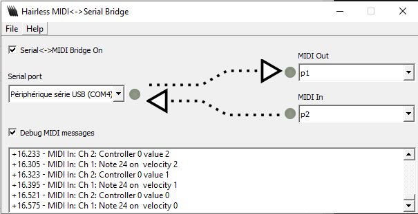
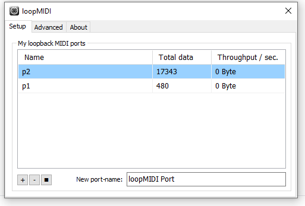
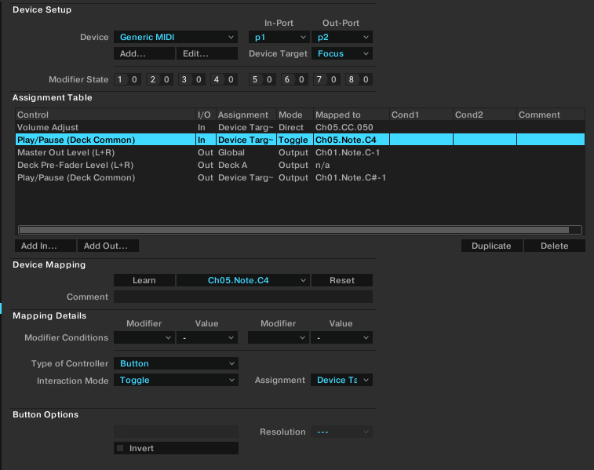
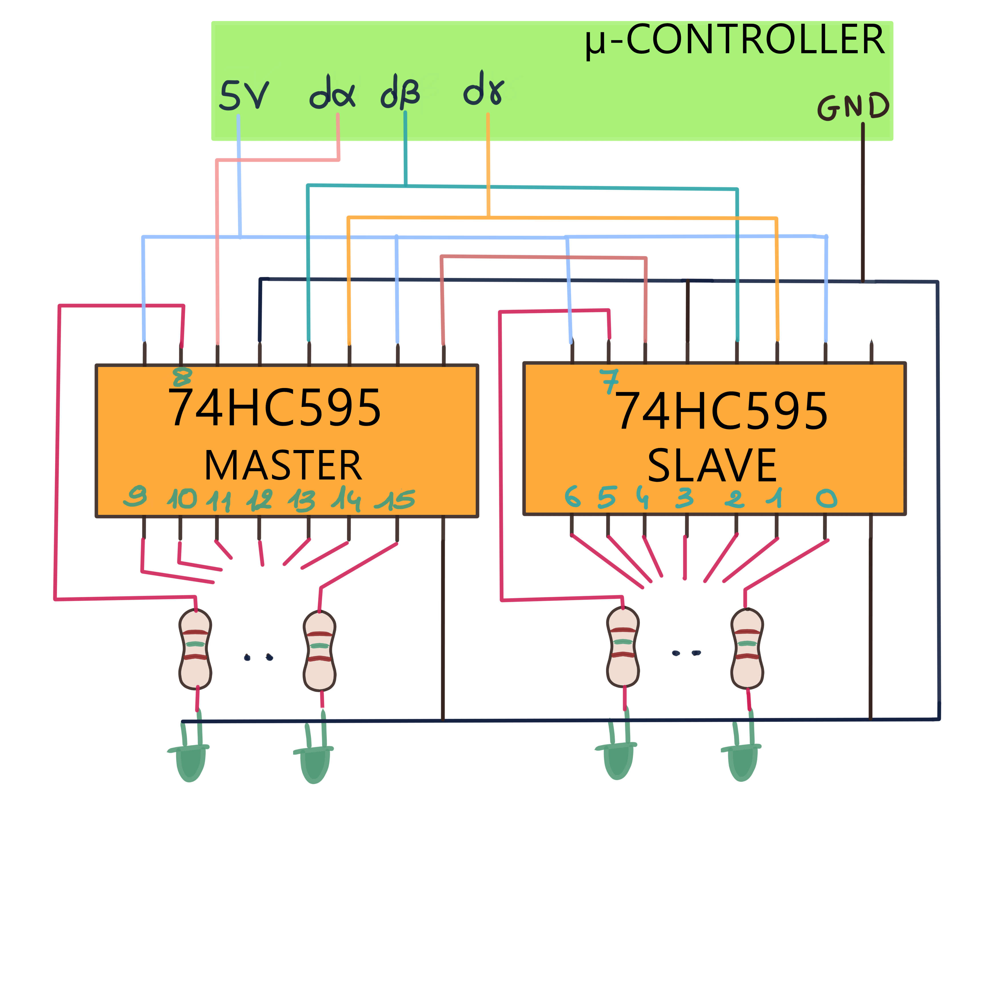

Watch the video test :
[](https://youtu.be/h2KTVaI7ic4)

---
Table of Contents
- [1 Purpose of the project](#1-purpose-of-the-project)
- [2 Compilation](#2-compilation)
  - [2.1 Compilation without the SERIE directive](#21-compilation-without-the-serie-directive)
    - [2.1.1 Without the SERIE directive: Arduino with the 16U2 chipset](#211-without-the-serie-directive-arduino-with-the-16u2-chipset)
    - [2.1.2 Without the SERIAL directive: Arduino with CH340 chipset (not 16U2)](#212-without-the-serial-directive-arduino-with-ch340-chipset-not-16u2)
  - [2.2 With the SERIE directive](#22-with-the-serie-directive)
- [3 Examples of configurations](#3-examples-of-configurations)
  - [3.1 Example of push button configuration](#31-example-of-push-button-configuration)
  - [3.2 Example of potentiometer configuration](#32-example-of-potentiometer-configuration)
  - [3.3 Example of a VU meter configuration with Arduino PINs](#33-example-of-a-vu-meter-configuration-with-arduino-pins)
  - [3.4 Example of a VU meter configuration with 2 X 74HC595 (configured for 16 leds)](#34-example-of-a-vu-meter-configuration-with-2-x-74hc595-configured-for-16-leds)
  
---

## 1 Purpose of the project

This is an Arduino Uno (Mega, ...) Midi project for :
 - send midi commands with potentiometers, push buttons,
 - read meter signals with Traktor in particular.

All the commands to send push buttons, and potentiometers, VU meters with digital PINS or with 74HC595 are made in the endless loop (loop).

Define set of BUTTON, etc, and put all theses references in an array : it is a good practise. BUTTON reference in 

## 2 Compilation

The compilation does not need any library in the Arduino folder.

It is made with the "Arduino" IDE environment.

### 2.1 Compilation without the SERIE directive

It will therefore be a "HID Midi compiant" <=> USB-HID device.

Without the SERIE directive by comminging this line of code like this:
```
//#define SERIE
```
[Wikipedia](https://en.wikipedia.org/wiki/Human_interface_device) => ...The term "HID" most commonly refers to the USB-HID specification. The term was coined by Mike Van Flandern of Microsoft when he proposed that the USB committee create a Human Input Device class working group...

In my case the Baudrate will be at 31250 (modifiable) because I made an update of the Arduino with :
 - [Updating the Atmega8U2 and 16U2 on an Uno or Mega2560 using DFU](https://www.arduino.cc/en/Hacking/DFUProgramming8U2),
 - [Moco Lufa](https://github.com/search?q=Moco+Lufa).

#### 2.1.1 Without the SERIE directive: Arduino with the 16U2 chipset

Thus the Arduino is seen as a "HID Midi compiant" component thanks to a recompilation made in DFU (Device Firmware Update) with the hexadecimal code of Moco Lufa (in my case).

The Baudrate at 31250 (tested and OK), from what I saw, is compatible with Moco Lufa and it would be possible to change this Baudrate ... [to see](https://forum.arduino.cc/index.php?topic=515491.0)

Steps to program the Aduino (with 16U2 chipset) in serial mode when it has been reprogrammed in DFU with Moco Lufa (in my case):
- unplug the Arduino and let the ISP pins free,
- connect the Arduino to start compilation in serial mode,
- disconnect it and connect pins 4 and 6 of the ISP,
- reconnect it so that it appears in USB-HID.


#### 2.1.2 Without the SERIAL directive: Arduino with CH340 chipset (not 16U2)

That we find in the Chinese version Arduinos [and the CH340 would be superior to the 16U2](https://makersportal.com/blog/2019/3/12/testing-the-arduino-ch340-board).

"Ch340 usb converter" modules exist, it seems that, thanks to this type of module, the Arduino would then be seen as a "HID Midi compiant" device.

### 2.2 With the SERIE directive

This compilation choice is made as follows:

```
#define SERIE
```

This uncommented preprocessor directive line implies that "Hairless" should be used.



with Baudrate put at 115200


where the inputs and outputs (I / O) p1 and p2 are Midi ports and generated with this software for example:



It will then be necessary to configure the I / O ports of Traktor like this for example:


## 3 Examples of configurations

### 3.1 Example of push button configuration

Note : Only noteOn is send (not a noteOff too after a delay).

```
BUTTON b[]={ {9, PULL_DOWN, PITCH_BEND, CHAN5, 11} };
```

- 9 : this button is configured on pin n° 9.
- PULL_DOWN : it is an externe pull-down configuration.
  Also PULL_UP and PULL_UP_ARDUINO are available.

  Note: For Arduino specific push button configuration, you should use PULL_UP_ARDUINO.
- PITCH_BEND : type of midi message. CC for control change and NOTE_ON for a noteOn are available.
- CHAN5 : the channel n° 5.
- 11 : the midi note.

An example of a configuration :



### 3.2 Example of potentiometer configuration

```
POTENTIOMETER p[] = { {A0, PITCH_BEND, CHAN5, 5} };
```

Only one potentiometer :

- A0 : is set to analog input pin A0.
- PITCH_BEND : type of midi message.
- CHAN5 : channel n° 5.
- 5 : the midi note number.

An example of a configuration with Traktor :


### 3.3 Example of a VU meter configuration with Arduino PINs

```
VUMETER v[] = { {2, 6, NOTE_ON, 0}, {8, 1, NOTE_ON, 1} };
```

There are 2 VU meters :

1st : {2, 6, NOTE_ON, 0} : 
- {2, 6 ... : from pin n° 2, 3, 4, 5, 6 ,7 
- , NOTE_ON,... : NoteOn type
- ..., 0} : his channel number. Remember 0 == first channel that is 1 in softwares). 

It is a vu-meter on 6 leds. It is defined like that in Traktor for example :
  


2nd : {8, 1, NOTE_ON, 1} : 
- {8, 1 ... : from pin n° 8 until pin n° 8 => only one led => The playing state
- , NOTE_ON,... : NoteOn type
- ..., 0} : his channel number (remember 0 == first channel that is 1 in softwares). 

It is a playing state. It is defined like that in Traktor for example :


### 3.4 Example of a VU meter configuration with 2 X 74HC595 (configured for 16 leds)

Because 2 X 74HC595 (or more cascaded IC) there are 2*8 Leds, so 16 in total.

The configuration is 
Another picture is 
where you can see the display order (0 to 15) if you use "test_direction_lights_STRUCT_74HC595()" function.

So if you want to use a VU meter which goes from 8 to 15 (from right to left) (15 is when the sound is big) you have to configure it like that :

```
byte* p1 [] = {
  &_74HC595_.t[8], &_74HC595_.t[9], &_74HC595_.t[10], &_74HC595_.t[11],
  &_74HC595_.t[12], &_74HC595_.t[13], &_74HC595_.t[14], &_74HC595_.t[15],
};
USE_PART_OF_74HC595 UPO_74HC595_1 = {CHAN1, CC, CONTROL0, p1, sizeof(p1) / sizeof(byte*), 0} ;
```
always put 0 in the end (..., 0} ;).

Another VU meter which goes from 7 to 0 (from right to left) (0 is when the sound is big) you have to configure it like that :
```
byte* p2 [] = {
  &_74HC595_.t[7], &_74HC595_.t[6], &_74HC595_.t[5], &_74HC595_.t[4],
  &_74HC595_.t[3], &_74HC595_.t[2], &_74HC595_.t[1], &_74HC595_.t[0],
};
USE_PART_OF_74HC595 UPO_74HC595_2 = {CHAN2, CC, CONTROL0, p2, sizeof(p2) / sizeof(byte*), 0} ;
```
Finally you put adress element like that
```
USE_PART_OF_74HC595* UPO_74HC595_ARRAY [] = { &UPO_74HC595_1, &UPO_74HC595_2 };
```
Configure the 2 X 74HC595 (or more) with searching "NB595" and put it like that :

```
#define NB595 2
```

Last thing :
```
struct _74HC595 {
  const byte serial_data;// 14
  const byte latch_clock;// 12
  const byte shift_clock;// 11
  byte t[NB595_TOT_BYTE];
};
```
where you define serial_data, latch_clock and shift_clock.

