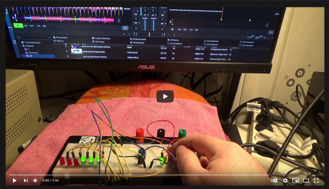
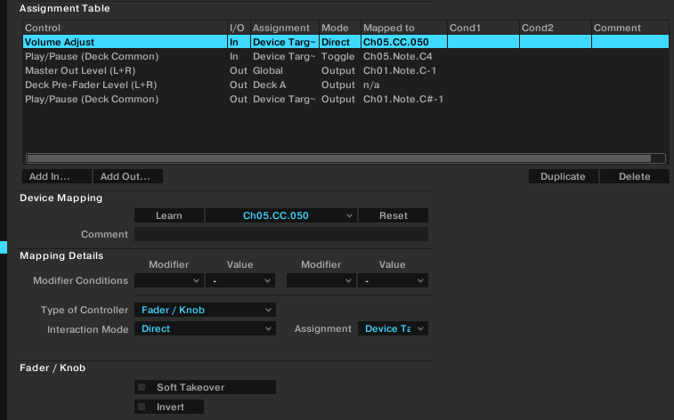
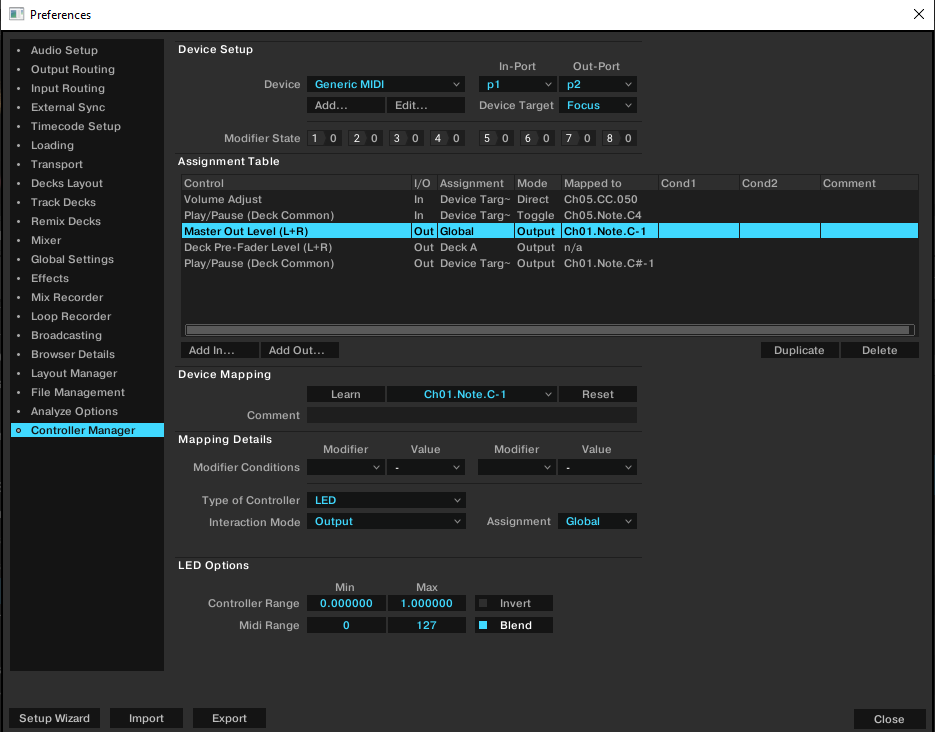
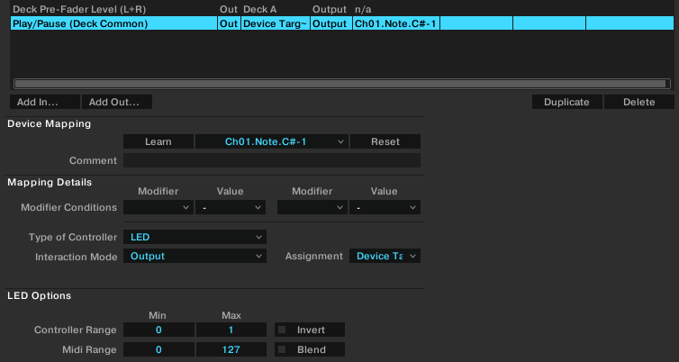

Watch the video test :
[](https://youtu.be/h2KTVaI7ic4)

---
Table of Contents
- [1 Purpose of the project](#1-purpose-of-the-project)
- [2 Compilation](#2-compilation)
  - [2.1 Compilation without the SERIE directive](#21-compilation-without-the-serie-directive)
    - [2.1.1 Without the SERIE directive: Arduino with the 16U2 chipset](#211-without-the-serie-directive-arduino-with-the-16u2-chipset)
    - [2.1.2 Without the SERIAL directive: Arduino with CH340 chipset (not 16U2)](#212-without-the-serial-directive-arduino-with-ch340-chipset-not-16u2)
  - [2.2 With the SERIE directive](#22-with-the-serie-directive)
- [3 Timer of 32 Hz for the Midi playback interruption](#3-timer-of-32-hz-for-the-midi-playback-interruption)
- [4 Examples of configurations](#4-examples-of-configurations)
  - [4.1 Example of push button configuration](#41-example-of-push-button-configuration)
  - [4.2 Example of potentiometer configuration](#42-example-of-potentiometer-configuration)
  - [4.3 Example of a VU meter configuration with Arduino PINs](#43-example-of-a-vu-meter-configuration-with-arduino-pins)
  - [4.4 Example of a VU meter configuration with 74HC595 (configured for 8 leds)](#44-example-of-a-vu-meter-configuration-with-74hc595-configured-for-8-leds)
- [5 The programme doesn't work](#5-the-programme-doesnt-work)
  
---

## 1 Purpose of the project

This is an Arduino Uno (Mega, ...) Midi project for :
 - send midi commands with potentiometers, push buttons,
 - read meter signals with Traktor in particular.

The commands to send push buttons, and potentiometers, are made in the endless loop (loop).

Note : If there is a bad configuration like :
- overflow of Vu-meter
- conflict with other PIN
- ...

the programme won't work.

To see the error messages and correct the configurations PINS, it is necessary to open a serial console at 115200 bauds.

## 2 Compilation

The compilation does not need any library in the Arduino folder.

It is made with the "Arduino" IDE environment.

### 2.1 Compilation without the SERIE directive

It will therefore be a "HID Midi compiant" <=> USB-HID device.

Without the SERIE directive by comminging this line of code like this:
```
//#define SERIE
```
[Wikipedia](https://en.wikipedia.org/wiki/Human_interface_device) => ...The term "HID" most commonly refers to the USB-HID specification. The term was coined by Mike Van Flandern of Microsoft when he proposed that the USB committee create a Human Input Device class working group...

In my case the Baudrate will be at 31250 (modifiable) because I made an update of the Arduino with :
 - [Updating the Atmega8U2 and 16U2 on an Uno or Mega2560 using DFU](https://www.arduino.cc/en/Hacking/DFUProgramming8U2),
 - [Moco Lufa](https://github.com/search?q=Moco+Lufa).

#### 2.1.1 Without the SERIE directive: Arduino with the 16U2 chipset

Thus the Arduino is seen as a "HID Midi compiant" component thanks to a recompilation made in DFU (Device Firmware Update) with the hexadecimal code of Moco Lufa (in my case).

The Baudrate at 31250 (tested and OK), from what I saw, is compatible with Moco Lufa and it would be possible to change this Baudrate ... [to see](https://forum.arduino.cc/index.php?topic=515491.0)

Steps to program the Aduino (with 16U2 chipset) in serial mode when it has been reprogrammed in DFU with Moco Lufa (in my case):
- unplug the Arduino and let the ISP pins free,
- connect the Arduino to start compilation in serial mode,
- disconnect it and connect pins 4 and 6 of the ISP,
- reconnect it so that it appears in USB-HID.


#### 2.1.2 Without the SERIAL directive: Arduino with CH340 chipset (not 16U2)

That we find in the Chinese version Arduinos [and the CH340 would be superior to the 16U2](https://makersportal.com/blog/2019/3/12/testing-the-arduino-ch340-board).

"Ch340 usb converter" modules exist, it seems that, thanks to this type of module, the Arduino would then be seen as a "HID Midi compiant" device.

### 2.2 With the SERIE directive

This compilation choice is made as follows:

```
#define SERIE
```

This uncommented preprocessor directive line implies that "Hairless" should be used.


with Baudrate put at 115200


where the inputs and outputs (I / O) p1 and p2 are Midi ports and generated with this software for example:


It will then be necessary to configure the I / O ports of Traktor like this for example:


## 3 Timer of 32 Hz for the Midi playback interruption

Input status led is red at ~32 Hz. 

## 4 Examples of configurations

### 4.1 Example of push button configuration

Note : Only noteOn is send (not a noteOff too after a delay).

```
BUTTON b[]={ {9, PULL_DOWN, PITCH_BEND, CHAN5, 11} };
```

- 9 : this button is configured on pin n° 9.
- PULL_DOWN : it is an externe pull-down configuration.
  Also PULL_UP and PULL_UP_ARDUINO are available.

  Note: For Arduino specific push button configuration, you should use PULL_UP_ARDUINO.
- PITCH_BEND : type of midi message. CC for control change and NOTE_ON for a noteOn are available.
- CHAN5 : the channel n° 5.
- 11 : the midi note.

An example of a configuration :


### 4.2 Example of potentiometer configuration

```
POTENTIOMETER p[] = { {A0, PITCH_BEND, CHAN5, 5} };
```

Only one potentiometer :

- A0 : is set to analog input pin A0.
- PITCH_BEND : type of midi message.
- CHAN5 : channel n° 5.
- 5 : the midi note number.

An example of a configuration with Traktor :



### 4.3 Example of a VU meter configuration with Arduino PINs

```
VUMETER v[] = { {2, 6, NOTE_ON, 0}, {8, 1, NOTE_ON, 1} };
```

There are 2 VU meters :

1st : {2, 6, NOTE_ON, 0} : 
- {2, 6 ... : from pin n° 2, 3, 4, 5, 6 ,7 
- , NOTE_ON,... : NoteOn type
- ..., 0} : his channel number. Remember 0 == first channel that is 1 in softwares). 

It is a vu-meter on 6 leds. It is defined like that in Traktor for example :
  


2nd : {8, 1, NOTE_ON, 1} : 
- {8, 1 ... : from pin n° 8 until pin n° 8 => only one led => The playing state
- , NOTE_ON,... : NoteOn type
- ..., 0} : his channel number (remember 0 == first channel that is 1 in softwares). 

It is a playing state. It is defined like that in Traktor for example :



### 4.4 Example of a VU meter configuration with 74HC595 (configured for 8 leds)

```
STRUCT_74HC595 ST_74HC595[] = { {PIN10, PIN9, PIN8, 0, CHAN1, CC, CONTROL0} };
```

- PIN10 : serial data from PIN 14 in 74HC595
- PIN9 : latch clock from PIN 12 in 74HC595
- PIN8 : shift clock from PIN 11 in 74HC595.
  Necessary to respect this order about theses conexions of 74HC595
- 0 : a direction to print the 8 leds
- CHAN1, CC, CONTROL0 : déjà vu.


## 5 The programme doesn't work

It is a bad configuration like :
- overflow of Vu-meter
- conflict with other PIN
- ...

To see the error messages and correct the configurations PINS, it is necessary to open a serial console at 115200 bauds.
